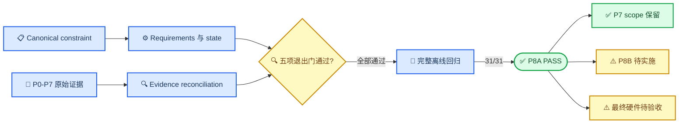

# RF_COMM_MULTILANE P8A 阶段报告

_阶段：P8A canonical requirements/state · 报告时间：2026-07-17 21:30 +08:00 · Profile：`P8A_BASELINE`_

---

```text
DOCUMENT_STATUS: NON_CANONICAL_STAGE_REPORT
STAGE: P8A
STAGE_RESULT: PASS
CURRENT_PROGRAM_STAGE: P8B_GEOMETRY_MAPPING_HANDOVER
NO_HARDWARE_ACTIONS_EXECUTED: true
HARDWARE_SCOPE_PROMOTED: false
CURRENT_RUN_HARDWARE_AUTHORIZATION: false
WORKTREE_CHECKPOINT: UNCOMMITTED
```

> 📌 **状态来源：** 本报告是阶段快照，不替代 [`config/project_state.json`](../config/project_state.json) 和由其生成的 [`PROJECT_STATUS.md`](../PROJECT_STATUS.md)。

## 📋 执行摘要

- **阶段结论：** P8A 五项退出门全部通过，P8A 状态为 `PASS`
- **基线建立：** 已建立 28 项机器可读需求，其中 6 项 P8A 流程需求为 `PASS`，22 项产品硬需求保持 `PENDING`
- **回归结果：** 最终完整离线门共 31 项，全部返回码为 `0`；P8A 单元测试 10/10 通过
- **范围边界：** 保留 P7 stationary two-lane `PASS` 与 Z7010 `PLATFORM_LIMITED_PASS`，未提升 Z7020、旋转或最终产品硬件状态
- **安全边界：** 全过程使用 `NO_HARDWARE=1`，未连接、编程或驱动任何真实硬件

## 📊 阶段状态



| Scope | 当前状态 | 本阶段影响 |
| --- | --- | --- |
| **P8A canonical baseline** | `PASS` | 建立机器可验证基线 |
| **P7 stationary 2-lane application** | `PASS` | 原 scope 保留 |
| **Current Z7010 platform** | `PLATFORM_LIMITED_PASS` | 不向目标平台外推 |
| **Z7020 target** | `PENDING_Z7020_HW` | 未提升 |
| **Rotation** | `PENDING_FINAL_MECHANICAL` | 未提升 |
| **Final product hardware** | `PENDING_HW` | 未提升 |
| **P8B geometry/mapping/handover** | `PENDING` | 下一独立阶段 |

## ✅ 完成内容

### Canonical 与状态基线

- 将 [`PROJECT_CONSTRAINTS.md`](../PROJECT_CONSTRAINTS.md) 收敛为非规范指针，唯一规范源仍为未修改的 [`PROJECT_CONSTRAINTS.txt`](../PROJECT_CONSTRAINTS.txt)
- 建立 [`config/project_requirements.yaml`](../config/project_requirements.yaml)，覆盖 V3.1 初始 22 项硬需求及 6 项 P8A 流程需求
- 建立 [`config/project_state.json`](../config/project_state.json)，并由生成器维护根目录 [`PROJECT_STATUS.md`](../PROJECT_STATUS.md)
- 建立 [`docs/REQUIREMENT_TRACEABILITY_MATRIX.md`](REQUIREMENT_TRACEABILITY_MATRIX.md)，明确 `PASS`、`PENDING`、证据路径与 artifact hash

### 历史证据 reconciliation

- 对 P0-P7 final JSON、Markdown 与 raw ledger 完成确定性 reconciliation
- 保留 `AB_L1_BAD_DIR` 与 P7 r41 immutable FAIL 历史
- 将当前 lane1 可用性严格限制为 P7 stationary Z7010 two-lane scope
- 明确禁止外推到 Z7020、sector bank、rotation 与 final product

### 自动化与回归

- 新增 fail-closed state、requirements、scope 与 artifact hash 校验
- 新增 byte-exact LF 生成文件检查，避免跨平台换行导致内容寻址失效
- 将 P8A 单元测试与一致性门纳入 [`scripts/run_offline_gates.py`](../scripts/run_offline_gates.py)
- 完成当前工作树上的最终完整离线回归，包括 Vivado 非硬件构建及 Xilinx 仿真

## 🔍 验证结果

| Test ID | Profile | 结果 | 直接证据 |
| --- | --- | --- | --- |
| `P8A-CANONICAL-CONSTRAINT-GATE` | `P8A_BASELINE` | `PASS` | [`p8a_consistency_summary.json`](../evidence/generated/p8a_consistency_summary.json) |
| `P8A-PROJECT-STATE-CONSISTENCY` | `P8A_BASELINE` | `PASS` | [`p8a_consistency_summary.json`](../evidence/generated/p8a_consistency_summary.json) |
| `P8A-REQUIREMENT-TRACEABILITY-BASELINE` | `P8A_BASELINE` | `PASS` | [`p8a_consistency_summary.json`](../evidence/generated/p8a_consistency_summary.json) |
| `P8A-P0-P7-EVIDENCE-RECONCILIATION` | `P8A_BASELINE` | `PASS` | [`p8a_p0_p7_reconciliation.json`](../evidence/generated/p8a_p0_p7_reconciliation.json) |
| `P8A-SCOPE-NONPROMOTION-GATE` | `P8A_BASELINE` | `PASS` | [`p8a_consistency_summary.json`](../evidence/generated/p8a_consistency_summary.json) |
| `P8A-LEGACY-CURRENT-SCOPE-RECONCILIATION` | `P8A_BASELINE` | `PASS` | [`p8a_p0_p7_reconciliation.json`](../evidence/generated/p8a_p0_p7_reconciliation.json) |
| `P8A-UNIT-TESTS` | `P8A_BASELINE` | `PASS`，10/10 | [`offline_gate_summary.json`](../evidence/generated/offline_gate_summary.json) |
| `P8A-OFFLINE-FULL-REGRESSION` | `NO_HARDWARE_OFFLINE` | `PASS`，31/31 | [`offline_gate_summary.json`](../evidence/generated/offline_gate_summary.json) |

完整离线门同时确认：`NO_HARDWARE_ACTIONS_EXECUTED=true`、`hardware_acceptance_scope=NO_NEW_HARDWARE_SCOPE_EVALUATED`，且全部 31 个结果的 `returncode=0`。

## 📦 Artifact 冻结

以下 SHA256 是本报告生成时的 byte-exact 快照。完整离线门摘要包含本机工具路径和运行时间，后续重跑会形成新的内容哈希。

| Artifact | SHA256 |
| --- | --- |
| [`PROJECT_CONSTRAINTS.txt`](../PROJECT_CONSTRAINTS.txt) | `9688fd14a3a7431c06e65218cbc776a0c6b69e6fc544ab7fd23e20ae42a90758` |
| [`config/project_state.json`](../config/project_state.json) | `d08e11cf33a34154a9b1c87b95f0ff612a2f006f250b6b833f7bfd89d83596bd` |
| [`config/project_requirements.yaml`](../config/project_requirements.yaml) | `9b822ae759008d69b4e6239774638c02d535600d329cfd0d75caa517e3018b54` |
| [`PROJECT_STATUS.md`](../PROJECT_STATUS.md) | `d333ddf403be6f8942d679cc7d00c98253deffbc022025fa9d8b450e24431620` |
| [`REQUIREMENT_TRACEABILITY_MATRIX.md`](REQUIREMENT_TRACEABILITY_MATRIX.md) | `aee2aa82dad6f1d1124cd210c8cadf5e1c530b8ba2e5fa481436313b565c0111` |
| [`p8a_p0_p7_reconciliation.json`](../evidence/generated/p8a_p0_p7_reconciliation.json) | `8d3de8a562e72c8c635099c24090ee33c15b585b265090aa83d14881e3d1f76d` |
| [`p8a_consistency_summary.json`](../evidence/generated/p8a_consistency_summary.json) | `b3e62400c0069ac2718bb1ca2438480122ac3e4381c506ac4eb28bbe06d667e0` |
| [`offline_gate_summary.json`](../evidence/generated/offline_gate_summary.json) | `eff257f0a5e920930e3b02edf08ad37754bc408dd9deef5e9a456124ceb9b5d4` |
| [`plan_completion_audit.md`](../evidence/generated/plan_completion_audit.md) | `c4009f48153e193130b9d849817a3f6d1f989ef4013ff8d116c2e5a3e0582b0c` |

## ⚠️ 范围边界与剩余风险

| 项目 | 当前结论 | 关闭条件 |
| --- | --- | --- |
| **P8B geometry/mapping** | `PENDING` | permutation、crossbar、epoch 与 worst-case model |
| **P8C safety/permit** | `PENDING` | exact duty、single `GLOBAL_PERMIT` 与 fault properties |
| **P8D selective-repeat/DMA** | `PENDING` | SACK、outstanding、DMA ring 与 throughput model |
| **P8E dual-target build** | `PENDING` | Z7010/Z7020 build、timing、resource 与 CDC |
| **Z7020 hardware** | `PENDING_Z7020_HW` | 独立目标板硬件证据 |
| **Rotation/final mechanics** | `PENDING_FINAL_MECHANICAL` | 最终光机与 600 rpm 分级验收 |
| **Final product hardware** | `PENDING_HW` | 全部最终字段的直接硬件证据 |

> ⚠️ **禁止外推：** P8A 是离线 canonicalization checkpoint；它既不能替代 P8B-P8E，也不能把 P7 stationary 2-lane PASS 解释为 Z7020、8-lane、旋转或最终产品 PASS。

当前没有需要追加的硬件授权。任何未来硬件运行仍需新的 current-run authorization、冻结 artifact hash、有限运行时间、安全 wrapper 与完整 shutdown 证据。

## 📍 下一阶段

下一独立工作包为 `P8B_GEOMETRY_MAPPING_HANDOVER`：

1. 实现 current、forward-candidate 与 reverse-candidate 映射函数
2. 建立 bank-to-lane 与 lane-to-bank-slot 显式 8×8 crossbar
3. 验证正反转、停转、重启及 `q=3→0`、`q=0→3` 边界
4. 实现 path epoch 原子 commit 与 stale rejection
5. 建立 phase uncertainty、data age、acquisition 与 worst-case overlap model
6. 输出 handover prepare、commit 与 service-gap 独立指标

P8B 完成前，`MAP-001`、`MAP-002`、`MAP-003` 及相关几何要求继续保持 `PENDING`。

## 🔗 证据索引

- [`PROJECT_STATUS.md`](../PROJECT_STATUS.md) — 当前生成状态
- [`REQUIREMENT_TRACEABILITY_MATRIX.md`](REQUIREMENT_TRACEABILITY_MATRIX.md) — 需求与验证追踪
- [`p8a_consistency_summary.md`](../evidence/generated/p8a_consistency_summary.md) — P8A 五项退出门
- [`p8a_p0_p7_reconciliation.md`](../evidence/generated/p8a_p0_p7_reconciliation.md) — P0-P7 证据 reconciliation
- [`offline_gate_summary.md`](../evidence/generated/offline_gate_summary.md) — 完整离线门输出
- [`plan_completion_audit.md`](../evidence/generated/plan_completion_audit.md) — 计划完成审计

---

_报告结束。P8A 已关闭；当前程序阶段为 P8B，硬件授权仍为 `false`。_
