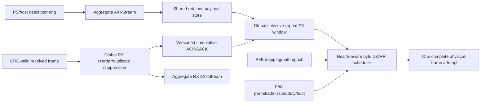

# P8D Selective-Repeat Aggregate Data Plane

Status: portable offline implementation contract. This is not DMA/DDR, board-throughput, Z7020, rotating, or final-product hardware acceptance.

## Canonical source and profiles

`config/p8d_data_plane.yaml` is the sole P8D parameter source. `scripts/generate_p8d_data_plane_config.py` validates it and generates the SystemVerilog package, C header, Python constants, JSON constants, and parameter table. Generated files must pass `--verify`; hand-edited copies are not canonical.

| Profile | Logical lanes | Global TX outstanding | SACK bits | Aggregate AXIS width | Physical safety accounting |
|---|---:|---:|---:|---:|---:|
| `Z7010_2LANE_DEV` | 2 | 32 | 32 | 32 | 2 modules |
| `Z7020_ROTATING_8LANE_MODEL` | 8 | 64 | 64 | 64 | 8 modules |
| `Z7020_FIXED_32MODULE_ACCOUNTING_MODEL_WITH_8LANE_DATA_PLANE` | 8 | 64 | 64 | 64 | 32 modules |

All profiles elaborate the same protocol RTL. A lane is an attempt resource, not an ARQ namespace. There is exactly one sequence allocator, one bounded TX window, one RX reorder window, and one retained payload-store namespace per endpoint and direction.

## Ownership and flow

The TX entry owns its sequence, session, payload reference, descriptor correlation, priority, last lane/path epoch, attempt count, retry count, and timer until ACK, deterministic failure, or abort. A retry may update attempt metadata and lane/path only. Its sequence, session, object/fragment identity, and bytes do not change. ACKed entries are removed from the attempt set and can neither migrate nor complete twice. A timed-out retry excludes its previous lane whenever at least one other safe eligible lane exists; the previous lane is admitted only when it is the sole eligible path. This provides deterministic path diversity without preventing 4-to-3-to-2-to-1 degradation.

RX validates L1 CRC/length before session, sequence, and path rules. An out-of-order entry is stored once. Only a contiguous prefix advances `rx_base` and reaches application delivery. Duplicate, old, future, stale-session, and stale-path frames cannot publish payload or release a descriptor.

## Scheduler and safety boundary

`ir_health_weighted_scheduler` uses byte-cost weighted deficit round robin. Eligibility is the intersection of active, ready, healthy, mapping-valid, frame-admitted, lane-permitted, duty-headroom, and fault-free masks. Receiver credit, path validity, endpoint arm, TX kill, and the single effective `GLOBAL_PERMIT` are endpoint-wide gates. Retry priority is bounded by an eight-attempt burst; normal traffic therefore retains an admission opportunity.

`ir_data_plane_top` rechecks all live safety and mapping conditions at the final physical-attempt handshake. A permit drop or late fault consumes the stale scheduler decision without consuming the TX entry. Re-arm never resumes a partial frame; the entry is retried from a complete frame boundary. Receive-only operation is independent of the TX scheduler.

P8D introduces no global-permit source or override. `GLOBAL_PERMIT=1` remains necessary but insufficient. All final Txd safety, exact 1 ms rolling duty, stuck-high, one-hot, startup, and shutdown semantics remain owned by P8C.

## Bounded resources

- TX window: 32 or 64 entries; window size is below the 16-bit half-space.
- RX reorder window: 64 entries; SACK capability is at least 32 bits.
- Retry: maximum seven, saturating bounded RTO.
- ACK aggregation: eight frames or 32,000 core clocks, plus credit/gap/control/boundary triggers.
- Independent TX and RX descriptor rings: 64 entries each, monotonic counters and 16-bit generation.
- Payload memory: one shared entry-indexed store; per-lane queues hold references only.
- RFAP vNext: at most 1 MiB in-flight by contract; a whole object is never required in PL or PS memory.

Ring-full and window-full conditions backpressure their producer. No normal path overwrites an unacknowledged payload or a hardware-owned descriptor.

## AXI-Stream contract

`ir_axis_tx_frontend` and `ir_axis_rx_backend` implement a one-beat elastic boundary. While `TVALID=1 && TREADY=0`, `TDATA`, `TKEEP`, `TLAST`, and `TUSER` remain stable. Non-final beats require full contiguous `TKEEP`; the final byte count must equal descriptor length. Zero length, non-contiguous keep, premature/late `TLAST`, and metadata mismatch raise an explicit protocol error. Backpressure changes timing only, never ownership or packet contents.

The legacy P7 MMIO path remains a compatibility/debug path and is not the P8D fast path.

## Acceptance boundary

Python reference campaigns, XSIM, host/ARM compile tests, and OOC synthesis demonstrate portable semantics and architecture feasibility only. Real AXI DMA IP, DDR, HP-port integration, cache coherency on Zynq, electrical/optical throughput, and final CDC/timing closure remain P8E/P9 or later work.
