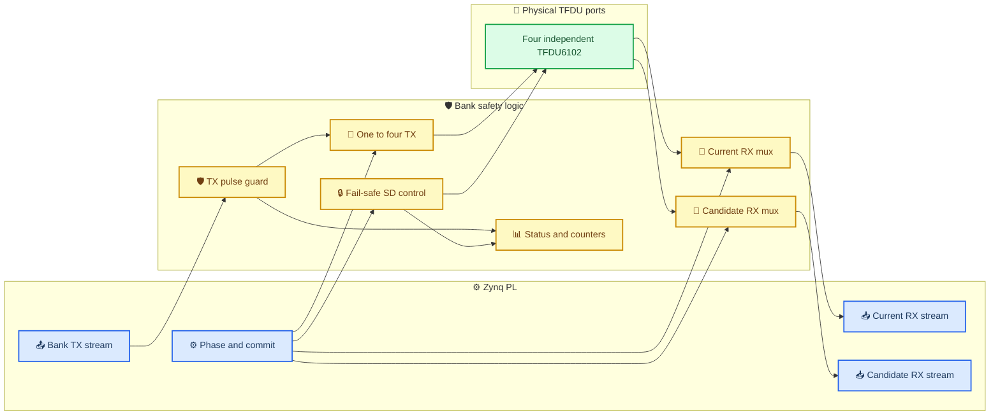
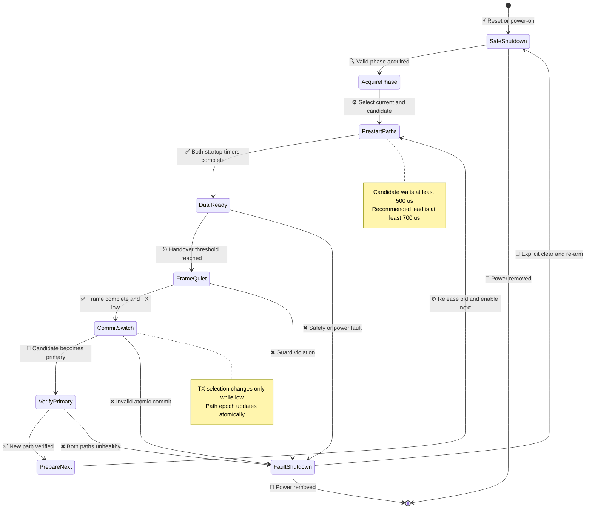

# TFDU6102 四模块周向 sector bank 架构

_固定侧 32 模块拆分为 8 个周向 bank 的原理图级设计，适用于 Zynq-7020 或资源兼容平台_

```text
NO_HARDWARE_ACTIONS_EXECUTED: true
HARDWARE_ACCEPTANCE: PENDING_HW
```

---

## 📋 设计结论

固定侧 32 个 TFDU6102 沿圆周均匀分布、旋转侧 8 个 TFDU6102 沿圆周均匀分布时，将固定侧划分为 **8 个周向 sector bank** 是合理的。每个 sector bank 管理连续的 4 个固定侧模块，并在正常通信时提供：

- 1 条独立发射数据路径
- 1 条当前接收路径
- 1 条候选接收路径
- 4 路独立 `SD` 和 `Txd` 安全控制
- 当前/候选模块的原子选择、启动计时、故障隔离和状态读回

这里的“一路工作”定义为 **最多一个模块发射**。为了满足 500 µs 预启动和 make-before-break handover，同一 bank 在交接期间必须允许两个接收器同时 active，但候选模块的 `Txd` 必须保持为 `0`。

> ⚠️ **术语说明：** 本文把 4 个相邻固定模块组成的单元记为 `S0..S7` sector bank。项目规范中的 `B0..B3` 是每组 8 个模块的“相位 Bank”，两种分组是同一 32 模块矩阵的行列两种视图，不能混用编号。

## 🎯 几何映射与充分性

### 物理编号

设固定侧模块按圆周角度依次编号为 `F0..F31`，相邻间隔 `11.25°`。sector bank `Sj` 定义为：

```text
Sj = { F(4j+0), F(4j+1), F(4j+2), F(4j+3) }
j = 0..7
```

bank 内模块编号 `Mp` 定义为：

```text
Sj.Mp = F(4j+p)
p = 0..3
module_angle(j,p) = 45° × j + 11.25° × p
```

在固定侧半径 `R=300 mm` 时，相邻模块的圆弧间距约为：

```text
300 mm × 11.25° × π / 180° ≈ 58.9 mm
```

每个 sector bank 覆盖 `45°` 周期中的 4 个候选相位。8 个旋转模块也相隔 `45°`，所以在任一稳定相位下，每个 sector bank 恰好为一个旋转模块提供当前固定侧光学路径。

### 全局相位选择

按照项目几何模型：

```text
m = floor((rotor_phase + 5.625°) / 11.25°) mod 32
q = m mod 4
s = floor(m / 4) mod 8
```

其中：

| 符号 | 含义 |
| --- | --- |
| `q` | 所有 sector bank 共用的当前模块索引 `0..3` |
| `s` | sector bank 与逻辑 lane 之间的循环偏移 `0..7` |
| `j` | 物理 sector bank 编号 `0..7` |
| `k` | 稳定逻辑 lane 编号 `0..7` |

当前模块和逻辑 lane 的关系为：

```text
current_module(Sj) = Sj.Mq
k = (j - s) mod 8
```

因此所有 8 个 sector bank 可以共享同一个 `q[1:0]`，而 Zynq PL 使用一个 8 路循环置换网络处理 `s`。

### 为什么必须保留双接收

600 rpm 时转速为 `3600°/s`。如果先关闭旧模块，再启动新模块，TFDU6102 的 500 µs 启动等待会产生至少：

```text
3600°/s × 500 µs = 1.8°
```

的不可接收角区。该 gap 不满足项目的连续 `logical_lane_ready_count == 8` 目标。因此，一个发射路径是充分的，但一个接收路径不是充分的；在不做本地帧合并的并行 raw 接口下，当前和候选两条 RX 路径是连续 handover 的下界。

## ⚙️ 单 bank 总体架构



### bank 外部接口

| 信号 | 方向 | 宽度 | 作用 |
| --- | --- | ---: | --- |
| `bank_tx` | Zynq → bank | 1 | 已完成 4PPM 编码的高有效 TX 脉冲流 |
| `bank_rx_current_n` | bank → Zynq | 1 | 当前模块的低有效 RX 脉冲流 |
| `bank_rx_candidate_n` | bank → Zynq | 1 | 候选模块的低有效 RX 脉冲流 |
| `current_sel` | 控制 → bank | 2 | 当前模块索引 `q` |
| `candidate_sel` | 控制 → bank | 2 | 候选模块索引，支持正反转 |
| `selection_commit` | 控制 → bank | 1 | 在 quiet window 原子提交选择 |
| `safe_run` | 控制 → bank | 1 | 硬件运行许可，默认 `0` |
| `bank_enable` | 控制 → bank | 1 | 单 bank 使能，默认 `0` |
| `global_permit` | 安全 → bank | 1 | 物理运行许可；bank 端下拉，断线或掉电即撤销许可 |
| `status/readback` | bank → 控制 | 串行 | 配置、启动、故障和计数读回 |

8 个 bank 的高速并行数据路径总计为 `8 TX + 16 RX = 24` 个 Zynq IO。共享实时控制、全局关断和串行读回通常再使用约 `5..9` 个 IO。

### 推荐的单 bank 实体实现

首版建议把每个 sector bank 做成一块可独立替换的前端板：

| 单元 | 数量 | 最低职责 |
| --- | ---: | --- |
| TFDU6102 | 4 | `M0..M3` 光学收发 |
| 小型 CPLD | 1 | 3.3 V IO、`≥64 MHz`、建议 `≥40` 个可用 IO；选择、计时、双 RX mux、TX guard、状态机和读回 |
| 四通道 fail-safe TX buffer | 1 | 每通道独立使能，未使能时由 TFDU 端下拉保持 `Txd=0` |
| SD 开漏下拉通道 | 4 | CPLD 只申请唤醒，外部硬件许可撤销后全部释放为 `SD=1` |
| VCC2 保护开关/eFuse | 1 | bank 级过流、欠压和故障隔离 |
| 去耦与 bulk | 4 组 + 1 组 | 每模块本地去耦，bank 入口吸收供电线电感 |

CPLD 需要回采实际 `Txd[3:0]`，不能只观察内部选择信号。按 `4 Rxd + 4 Txd feedback + 1 bank_tx + 2 RX output + 8 TX/SD control + clock/control/power/status` 估算，32 IO 器件余量过小，建议从 `≥40` 个用户 IO 起选。

推荐使用一条所有 bank 共享的同步控制总线，而不是为每个 bank 单独拉选择线：

```text
CLK64
CTRL_SCLK / CTRL_MOSI / CTRL_MISO
CTRL_LATCH
GLOBAL_PERMIT
FAULT_N
```

每块 bank 板用 3 位电阻绑带定义 `bank_id`。控制帧可固定为 48 bit：

```text
sync[3:0] | version[3:0] | path_epoch[7:0] | q[1:0] |
direction | safe_run | bank_enable_mask[7:0] | tx_enable_mask[7:0] |
read_req | read_bank_id[2:0] | crc8[7:0]
```

`CTRL_LATCH` 只在 CRC、版本和 epoch 合法时原子提交。以 `10 MHz` 串行时钟计算，48 bit 传输只需 `4.8 µs`，低于 `100 µs` handover 更新预算；真正的切换仍由 PL 发出的 frame-quiet commit 触发。只有 `read_bank_id` 命中的 bank 可以驱动 `CTRL_MISO`，其余 bank 必须保持高阻。`FAULT_N` 使用开漏线做快速汇总，详细故障随后串行读取。

物理安全线应采用 active-high `GLOBAL_PERMIT`，并在每块 bank 板本地约 `100 kΩ` 下拉。文中的逻辑量 `global_kill` 定义为 `!GLOBAL_PERMIT`；这样断线、控制器掉电或连接器松脱都会进入关断，而不是继续运行。

## 🔧 选择逻辑

### 正转选择真值表

正转时，候选索引为 `(q+1) mod 4`：

| `q` | 当前模块 | 候选模块 | `awake_mask[3:0]` | TX 目标 | `s_next-s` |
| ---: | --- | --- | --- | --- | ---: |
| 0 | `M0` | `M1` | `0011` | `M0` | 0 |
| 1 | `M1` | `M2` | `0110` | `M1` | 0 |
| 2 | `M2` | `M3` | `1100` | `M2` | 0 |
| 3 | `M3` | `M0` | `1001` | `M3` | 1 |

反转时，候选索引改为 `(q-1) mod 4`；当 `q=0` 时，`s_next=s-1 mod 8`。

### 组合逻辑定义

```systemverilog
safe = rst_n
    && safe_run
    && bank_enable
    && config_valid
    && power_good
    && clock_alive
    && global_permit
    && !fault_latched;

awake_mask = safe
           ? (current_onehot
              | (candidate_enable ? candidate_onehot : 4'b0000))
           : 4'b0000;
tx_mask    = safe && tx_enable ? current_onehot : 4'b0000;

SD[i]   = !awake_mask[i];
Txd[i]  = guarded_bank_tx
       && tx_mask[i]
       && startup_done[i]
       && !module_fault[i];

Mode[i] = 1'b1;

bank_rx_current_n = current_path_valid
                  ? Rxd[current_sel]
                  : 1'b1;

bank_rx_candidate_n = candidate_path_valid
                    ? Rxd[candidate_sel]
                    : 1'b1;
```

实现必须保证：

```systemverilog
$onehot0(tx_mask)
$countones(awake_mask) <= 2
(tx_mask & ~awake_mask) == 0
(safe && candidate_enable) |-> (current_sel != candidate_sel)
```

### `q=3 → q=0` 的 lane 映射

正转跨越 `45°` sector 边界时，候选 `M0` 与当前 `M3` 虽然位于同一物理 sector bank 内，但对应的逻辑 lane 相差一个循环位置。Zynq PL 必须使用两个独立 barrel shifter：

```text
bank_tx[j] = lane_tx[(j - s) mod 8]
bank_tx_enable[j] = lane_tx_enable[(j - s) mod 8]

lane_rx_current[k] = bank_rx_current[(k + s) mod 8]

s_next = (s + (q == 3 ? 1 : 0)) mod 8
lane_rx_candidate[k] = bank_rx_candidate[(k + s_next) mod 8]
```

若省略 `s_next`，每跨越 `45°` 就会发生逻辑 lane ID 串位。

在 4+4 全双工模式中，`lane_tx_enable` 只允许四条发送方向 lane，另外四条 lane 的 `bank_tx` 必须保持 `0` 并作为接收方向工作。同一逻辑 lane 仍然是半双工；candidate 路径在任何模式下都禁止发射。

## 🔌 原理图级电路

### 每个 TFDU6102 支路

下列电路重复 4 次，分别对应 `M0..M3`：

| 网络 | 建议实现 | 默认安全状态 |
| --- | --- | --- |
| `Mode` | `10 kΩ` 上拉至 `VCC1=3.3 V`，预留 `0 Ω/DNP` 配置位 | HIGH，静态 MIR/FIR |
| `SD` | `10 kΩ` 上拉至 `VCC1`，由开漏 NMOS/开漏缓冲器只负责拉低 | HIGH，shutdown |
| `Txd` | 四通道安全缓冲器输出，经 `22..47 Ω` 源端串阻；TFDU 端 `10 kΩ` 下拉 | LOW，不发光 |
| `Rxd` | 直接进入本地 CPLD/两个独立 4:1 mux；可预留 `0..22 Ω` 调试串阻 | active 时推挽输出；shutdown 时内部约 `500 kΩ` 弱上拉 |
| `VCC1` | 独立 `47 Ω` 滤波支路，近端 `4.7 µF + 0.1 µF` | 低噪声接收电源 |
| `VCC2` | 3.3 V 时按数据手册直接供电，近端至少 `4.7 µF`；预留电流测量位但不串接调光电阻 | 高脉冲电流电源 |
| `GND` | 连续参考平面和短回流路径 | — |

`SD` 推荐采用开漏下拉结构：

```text
VCC1 ── 10 kΩ ──┬── TFDU SD
                 │
                 D
safe_enable ── AND ── gate  NMOS
                 S
                 │
                GND
```

`safe_enable=0`、CPLD 未配置、Zynq 复位或 bank 断开时，NMOS 必须关断，由上拉电阻自动令 `SD=1`。NMOS gate 应配置约 `100 kΩ` 下拉，避免控制器掉电时漂浮。

`GLOBAL_PERMIT` 必须在 CPLD 之外再次门控 TX buffer 和 SD NMOS，不能只作为 CPLD 的一个普通输入：

```text
tx_buffer_enable[i] = cpld_tx_request[i] AND GLOBAL_PERMIT AND power_good
sd_nmos_gate[i]     = cpld_awake_request[i] AND GLOBAL_PERMIT AND power_good
```

上述两个外部门控的默认状态都必须为 `0`。这样即使 CPLD 状态机失控，撤销 `GLOBAL_PERMIT` 仍能硬件强制 `Txd=0, SD=1`。

### TX 路径

候选接收器处于 active 状态时，其 `SD=0`。因此四个模块的 `Txd` 绝对不能简单并联；否则候选模块会随当前模块一起发射。

TX 路径必须采用以下任一种实现：

1. 本地 CPLD/FPGA 内完成 `1:4` one-hot demux 和所有安全 guard
2. 高速数字 `1:4` demux 加四通道 fail-safe buffer
3. `2-to-4` 译码器加四路与门，未选输出强制为低

无论采用哪种实现，最终送到 TFDU 引脚的实际 `Txd[3:0]` 都必须被逐路监测，而不是只监测 demux 之前的公共 `bank_tx`。

### RX 路径

两个 active TFDU6102 的 `Rxd` 都是推挽输出，不能并联。每个 bank 必须提供两个相互独立的 4:1 接收选择路径：

```text
Rxd[3:0] ── current 4:1 mux   ── bank_rx_current_n
Rxd[3:0] ── candidate 4:1 mux ── bank_rx_candidate_n
```

推荐在本地 CPLD/FPGA 中实现两个独立选择器。若使用分立 mux，两个 mux 必须具有独立选择控制；共用选择脚的“双 4:1 mux”不能覆盖 sector 边界映射和反转场景。

选择发生变化时，RX 输出先钳位为 idle HIGH，至少 blank `4` 个 64 MHz 时钟周期，再按 `startup_done` 和 `path_valid` 放行。协议层通过 `path_epoch` 丢弃切换瞬间的旧路径事件。

### 全局硬件关断

逻辑量 `global_kill = !GLOBAL_PERMIT` 必须绕过普通配置路径，并同时完成：

```text
TX buffer disable  → 所有 Txd 由下拉保持 LOW
SD pull-down disable → 所有 SD 由上拉恢复 HIGH
selection valid clear
startup_done clear
fault reason latch
```

仅复位 CPLD 状态机而不在引脚侧建立上拉/下拉，不构成 fail-safe 关断。

## ⚡ 电源与发射电流

### 电源域

建议使用两个 3.3 V 电源域：

| 电源域 | 负载 | 要求 |
| --- | --- | --- |
| `3V3_TFDU_LOGIC` | `VCC1`、bank CPLD/mux | 低噪声、独立滤波、持续供电 |
| `3V3_TFDU_IRED` | `VCC2/IRED` | 低阻抗、过流保护、脉冲能力和 droop 测试点 |

每个模块附近保留数据手册要求的 `4.7 µF` 和 `0.1 µF` 级去耦。每个四模块 bank 另放置首样 `47..100 µF` 低 ESR bulk footprint，最终数值由 VCC2 droop 和 PCB PDN 测量确定。

### 20 cm 电流设计

20 cm 距离并不意味着链路预算一定需要 `600 mA`，但 **TFDU6102 本身不是可编程发射电流器件**。其数据手册把 IRED 描述为内部开关限流器，合法工作峰值为 `500..600 mA`；在 `VCC1=VCC2=3.3 V` 的推荐电路中明确要求不串外部电阻。数据手册中的 `R1=2 Ω` 只用于 5 V/高温时限制器件内部功耗，不是 3.3 V 下的光功率调节器。

因此首版硬件应按以下两层策略设计：

1. **保留 TFDU6102：** 每个 active 发射器按最坏 `600 mA` 峰值设计 VCC2、去耦、走线、连接器和保护；通过“每 bank 最多一个 TX”和协议空闲时间降低阵列平均电流，不改变合法 4PPM 脉宽。
2. **确实需要降低峰值：** 改用具有可编程 IRED 电流的收发器，或把发射器改成外置 IRED + 可控恒流驱动。简单增大 TFDU6102 的串联电阻会让内部限流器退出调节，辐射强度、脉宽、温漂和批次一致性均不再由数据手册保证，只能作为非 canonical 的实验支路。

正常逻辑保证每 bank 最多一个发射器：

```text
Ibank_peak ≤ 600 mA
Iarray_peak ≤ 8 × 600 mA = 4.8 A
```

因此当前 canonical 项目约束规定的 VCC2 `≥6 A` 工程能力是合理裕量，不因光程只有 20 cm 而删除。平均电流应根据真实 4PPM 占空比和业务流量另行计算，不能用平均值替代上述峰值 PDN 设计。

### 过流隔离与测量

每个 bank 建议增加独立、可复位的 VCC2 限流/电子保险丝，并输出 `PG/FAULT`。阈值应满足：

```text
单路合法 `600 mA` 峰值不误动作
双路错误发射或持续异常电流可被隔离
启动浪涌和本地 bulk 电容不造成误跳闸
故障不会拖垮其他 7 个 bank
```

低速 ADC 只能记录平均电流和电源趋势，不能证明 125 ns 级脉冲峰值。必须同时保留低电感 shunt/Kelvin 测试点和 VCC2 近端/远端示波器测试点。

## 🔄 handover 状态机



### 时序预算

| 项目 | 设计值 | 说明 |
| --- | ---: | --- |
| TFDU startup | `≥500 µs` | 每物理模块独立计时 |
| candidate lead | `≥700 µs` 目标 | 高于最低 startup 要求 |
| 600 rpm 相位周期 | `3.125 ms` | 每跨越 `11.25°` |
| 名义双覆盖窗口 | `≈1.334 ms` | 来自项目几何预算 |
| handover commit | `≤100 µs` 目标 | 必须在 PL/前端实时完成 |
| TX quiet guard | `2 µs` 首样参数 | 最终按器件时序和测量冻结 |
| RX mux blanking | `≥4` 个 64 MHz 周期 | 防止选择毛刺进入 PHY |
| TX→RX receive-valid guard | `≥300 µs` 首样值 | 暂按 TFDU6102 `latency` 最大值解释，须在 RTL 冻结前用器件波形复核 |

切换顺序固定为：

1. 阻止启动不能在安全窗口内结束的新帧
2. 等待当前帧结束并强制 `bank_tx=0`
3. 保持当前和候选接收器均为 ready
4. 原子提交 `q/s/path_epoch/TX select`
5. 验证新 primary 的 raw、frame CRC 或 ACK 健康状态
6. 关闭旧模块并启动再下一个候选模块
7. 候选完成 500 µs startup 后恢复 `DualReady`

方向反转、编码器失效或相位跳变时不得直接翻转候选索引。必须先进入 `SafeShutdown` 或 `AcquirePhase`，保持 `Txd=0`，重新选择并等待 startup。

## 📊 Zynq 侧映射与 IO 预算

### 8 bank 并行 raw 接口

| 类别 | 直接连接 32 模块 | 8 sector bank 方案 |
| --- | ---: | ---: |
| TX data | 32 | 8 |
| RX data | 32 | 16 |
| SD | 32 | 共享控制/本地逻辑 |
| Mode | 32 或静态 | 静态 HIGH，不占 Zynq IO |
| 合计数据 IO | 64 | 24 |
| 含 SD 的典型合计 | 96 | 约 `29..33` |

在保留 8 条独立 TX、8 条 primary RX 和 8 条 candidate RX 的并行 raw 架构中，`24` 个数据 IO 是下界。若希望低于 24 个 IO，只能：

- 在前端 FPGA 内完成采样、帧解码和 primary/candidate 去重，再输出 8 条逻辑 RX
- 使用源同步串行/LVDS 链路对 24 条 raw 流进行序列化

简单把两路 RX 做逻辑与或合并虽然能减少 IO，但会丢失物理路径来源、独立健康计数和新 primary 验证能力，不作为最终设计。

该下界可直接证明：handover 时 8 个 current RX 和 8 个 candidate RX 可以同时产生彼此独立的 raw 电平；若要求每个 64 MHz 采样时刻无损保留来源，接收接口必须能够表示任意 16 bit 状态，因此至少需要 16 条并行 RX 信息通道。8 个逻辑 lane 也允许在同一时刻产生彼此独立的 TX 电平，因此至少需要 8 条 TX 信息通道。本文架构恰好使用 `16 + 8 = 24` 条，所以在“不序列化、不在前端合并”的约束下既充分又达到下界。

充分性也成立：每个 sector bank 的 current/candidate mux 分别提供一对独立 RX，8 个 bank 合计覆盖当前和下一相位的全部 8 条逻辑 lane；两个由 `s` 和 `s_next` 控制的循环置换网络恢复稳定 lane ID；每 bank 的 one-hot TX demux 则同时提供 8 条唯一发射路径。

### 前端实现优先级

1. 一个靠近固定环的前端 FPGA 管理全部 8 个 sector bank，并向 Zynq 输出 `8 TX + 16 RX + telemetry`
2. 每个 sector bank 使用本地小 CPLD，再通过共享控制和并行 raw 数据连接 Zynq
3. 分立双 RX mux、TX demux、SD 锁存和外部 safety gate，仅作为原型

若 TFDU 到前端逻辑或前端逻辑到 Zynq 的单端走线较长，必须根据实测边沿而不是 4 Mbit/s 码率判断 SI；必要时改用 LVDS 或源同步串行接口。

## 🛡️ 安全、故障和可观测性

### 硬件不变量

前端 RTL/CPLD 必须检查以下不变量：

```systemverilog
assert property (!safe |-> (Txd == 4'b0000 && SD == 4'b1111));
assert property ($onehot0(tx_mask));
assert property ($countones(awake_mask) <= 2);
assert property ((tx_mask & ~awake_mask) == 0);
assert property (!startup_done[i] |-> !Txd[i]);
assert property (candidate_commit |-> candidate_startup_done);
assert property ($changed(tx_mask) |-> frame_idle && bank_tx == 1'b0);
assert property (Mode == 4'b1111);
```

每个模块还必须分别执行：

- `Txd` 连续高电平 `≤10 µs` 的当前项目 guard
- rolling duty window guard
- startup 未完成时 TX/RX 无效
- 非选中模块 `Txd=0`
- fault 自动 `Txd=0, SD=1`

### 故障动作

| 故障 | 必须动作 |
| --- | --- |
| reset、配置丢失、时钟失效 | 所有 `Txd=0`、所有 `SD=1` |
| `tx_mask` 非 one-hot | bank fault shutdown |
| `awake_mask` 超过两路 | bank fault shutdown |
| candidate 未 ready 就 commit | 拒绝切换，保持旧 primary |
| TX stuck-high 或 duty 超限 | 立即钳位 TX 并 shutdown bank |
| bank VCC2 过流/欠压 | 切断该 bank VCC2，其他 bank 继续 |
| encoder invalid | 停止盲目 handover，进入 acquisition/degraded |
| current 与 candidate 均不健康 | 标记逻辑 lane unavailable 并重新调度 |

### telemetry

每个物理模块至少输出：

- `module_id`、`bank_id`、`module_index`
- `sd_command`、`startup_done`、`path_valid`
- `tx_pulse_count`、`rx_raw_count`
- `rx_width_min/max`、`last_rx_timestamp`
- `tx_high_max`、`duty_high_count`
- `fault_stuck_high`、`fault_duty`、`fault_power`

每个 bank 至少输出：

- `current_sel`、`candidate_sel`、`awake_mask`、`tx_mask`
- `current_lane_id`、`candidate_lane_id`、`path_epoch`
- `selection_commit_count`、`handover_fail_count`
- `vcc2_voltage`、`average_current`、`power_fault`
- `global_kill_active`、`shutdown_reason`

配置应采用 shadow register + atomic commit，并支持一致读回。写入成功但无法读回的选择控制不应作为正式架构。

## 📐 PCB 与机械布局

### 模块布局

- `M0..M3` 光学中心角分别为 `0°/11.25°/22.5°/33.75°` 加 bank 基准角 `45°×j`
- 所有 TFDU 光轴径向向内，光学中心处于同一轴向平面
- 每个模块保留位置编号、角度基准和可替换 ID
- bank PCB 或线束不得侵入相邻模块光学窗口
- 相邻相位路径在 overlap 区重复收到同一帧是预期现象，应由 `path_epoch + sequence` 去重
- 使用短的消光隔板抑制相隔 `45°` 的非目标 rotor lane 串扰，但不得用未经 FOV sweep 验证的长遮光筒

### 电气布局

- 每个 TFDU 的高速去耦距电源引脚尽量小于 `10 mm`
- IRED 脉冲回路短、宽、独立回到 bank 电源入口
- `Rxd` 和逻辑地参考远离 VCC2 大电流回路
- `Txd/Rxd` 源端串阻靠近实际驱动器放置
- 不允许四路长 stub 直接汇聚到一个 Zynq 引脚
- 每个模块提供 `Txd/Rxd/SD/Mode/VCC1/VCC2/GND` 测试点
- bank 最远端提供独立 VCC2 droop 测试点

## 🧪 验证计划

### 离线验证

- 穷举 `q=0..3`、正转、反转和所有 `s=0..7`
- 验证 `q=3→0` 与 `q=0→3` 的循环 lane 映射
- 验证 primary/candidate 同时接收且候选 `Txd=0`
- 验证 125 ns、250 ns FIR 脉冲以及 20 ns 抖动传播
- 验证 mux 切换 blanking 不生成伪 raw pulse
- 注入 reset、clock loss、非法 mask、stuck-high、duty 和 power fault
- 证明所有 fault 路径最终进入 `Txd=0, SD=1`
- 证明当前 P0–P7 回归保持通过

### 后续授权硬件验证

硬件验证仍为 `PENDING_HW`，只有在单独授权和安全 wrapper 下才能执行。首轮应覆盖：

- 1 个旋转模块对 4 个固定模块的静止角度 sweep
- 标准 `500..600 mA` IRED 峰值、误码率和偏角余量测量；如需降峰值，另立非 canonical 器件/驱动选型试验
- current/candidate 双接收和 frame 去重
- 8 路同时业务下的相邻相位重复接收与跨 lane 串扰矩阵
- 500 µs startup 与 700 µs prestart
- `0→30→60→120→300→450→600 rpm` 逐级验证
- VCC2 峰值、droop、地弹、温升和 bank 过流隔离
- 正常、失败、超时和中断退出后的 shutdown 证据

任何离线结果都不得把 `HARDWARE_ACCEPTANCE` 提升为 PASS。

## 📌 尚未冻结的设计项

下列项目在原理图冻结前仍须确定：

- 前端采用单 FPGA、每 bank CPLD，还是分立逻辑
- 实际 Zynq-7020 板卡和可用 I/O bank 电压
- 两个独立 RX mux 的传播延迟、输入电容和 fail-safe 行为
- 是否保留固定 `500..600 mA` 峰值的 TFDU6102，或改用可编程电流的发射方案
- 3.3 V VCC2 公差、去耦和测流结构（标准方案不串调光电阻）
- bank VCC2 eFuse/限流阈值和 blanking
- TX→RX turnaround 最终参数
- PCB stack-up、最大单端走线长度和是否改用 LVDS
- 环境光、污染、温度和系统级眼安全边界
- 新的 canonical pinmap、XDC 和 register-map 扩展

在这些项目闭合以前，本文件是可实现的架构设计，不是硬件验收结论。

## 🔗 项目依据

- [项目约束与最终目标](../../PROJECT_CONSTRAINTS.txt)
- [TFDU6102 safety contract](../tfdu6102_safety_contract.md)
- [TFDU6102 safety summary](../TFDU6102_SAFETY_SUMMARY.md)
- [TFDU lane PHY spec](../TFDU_LANE_PHY_SPEC.md)
- [TFDU6102 electrical checklist](../TFDU6102_ELECTRICAL_CHECKLIST.md)
- [TFDU6102 本地数据手册](../datasheets/TFDU6102datasheet.pdf)
- [当前物理 PHY 实现](../../rtl/tfdu_lane_phy.sv)

---

_Last updated: 2026-07-17 · Hardware status: PENDING_HW_
