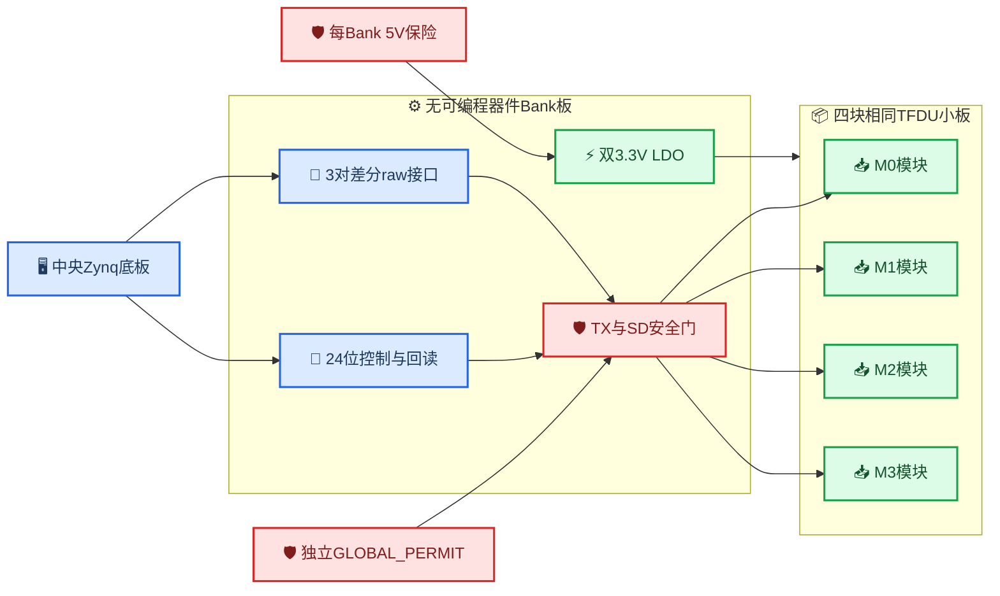

# TFDU6102 Bank板与TFDU小板原理图设计要求

_供另一个 Codex 项目直接开展原理图、PCB 与BOM设计；适用于固定侧8个Bank、每Bank连接4块TFDU6102小板_

```text
DOCUMENT_STATUS: SCHEMATIC_DESIGN_INPUT
REVISION: 1.1
DATE: 2026-07-17
REVISION_NOTE: REMOVE_PER_MODULE_PRESENCE_LOOP_AND_USE_8_PIN_MODULE_CONNECTORS
NO_HARDWARE_ACTIONS_EXECUTED: true
HARDWARE_ACCEPTANCE: PENDING_HW
```

---

## 📋 范围与规范等级

### 文档目的

本文是独立、可复制的原理图设计输入。接收本文的电路图设计项目不应依赖当前对话历史，应仅依据本文、TFDU6102数据手册和本文列出的项目约束完成设计。

本文覆盖：

- 固定侧单个4模块 `Bank` 板
- 单块通用 `TFDU6102` 小板，单Bank重复4块
- 底板至Bank的一根点对点线缆接口
- Bank至4块TFDU小板的4根点对点线缆接口
- 5 V输入、双路3.3 V LDO、电源默认状态、硬件发射保护和状态回读

本文不覆盖：

- Zynq底板的完整原理图
- 旋转侧FPGA、电池、BMS和机械旋转结构
- FPGA RTL、FreeRTOS、协议栈和上位机软件
- 系统级光学、眼安全或600 rpm硬件验收

### 规范用语

| 用语 | 含义 |
| --- | --- |
| **必须** | 原理图和PCB不可违反的要求 |
| **禁止** | 不允许采用的实现 |
| **应** | 默认实现；偏离时必须给出等效性分析 |
| **可以** | 不影响接口和安全不变量的实现自由度 |

若本文与[项目硬约束](../../PROJECT_CONSTRAINTS.txt)冲突，以项目硬约束为准。本文不修改项目硬约束，也不授权任何硬件执行。

### 本次已确认的变更

本设计以如下电源决定替代旧Bank架构中的 `VCC2 eFuse + VCC1/VCC2双路监测`建议：

- Bank输入改为 `5V_IN`
- Bank本地使用两颗独立3.3 V LDO
- Bank不装eFuse、电流监测ADC或VCC1/VCC2精密双路监测器
- 底板每个Bank的5 V支路保留独立保险丝或自恢复保险丝
- Bank仅保留一个用于复位资格判断的单比特 `LOGIC_POWER_OK`
- `3V3_IRED/VCC2` 保留测试点，但不提供运行时电压遥测

这里的 `LOGIC_POWER_OK` 仅监测Bank逻辑3.3 V母线，不等同于VCC1/VCC2运行时监测。

## 🎯 已冻结的架构决定

### 系统数量和职责

| 项目 | 冻结要求 |
| --- | --- |
| 固定侧中央控制器 | 一块Zynq-7020 FPGA底板 |
| 固定侧Bank数量 | 8 |
| 每Bank模块数量 | 4 |
| 固定侧TFDU总数 | 32 |
| 每Bank并发TX | 最多1个 |
| 每Bank并发RX | primary和candidate最多2个 |
| Bank可编程器件 | 禁止FPGA、CPLD、MCU |
| TFDU小板可编程器件 | 禁止FPGA、CPLD、MCU |
| `Mode` | 小板本地固定为HIGH |
| `SD` | 由中央FPGA通过Bank串行原子锁存控制 |
| Bank至TFDU信号 | 单端3.3 V，不使用差分 |
| 底板至Bank raw数据 | 3对差分：1路TX、2路RX |

### 禁止事项

- 禁止四个 `Txd` 直接并联
- 禁止四个 `Rxd` 直接并联
- 禁止使用共用选择脚的单颗“双4:1 MUX”产生两个独立RX选择
- 禁止把 `GLOBAL_PERMIT` 放入普通串行命令后才参与门控
- 禁止以FPGA配置完成、软件命令或GPIO默认值替代硬件安全偏置
- 禁止将5 V直接送入本设计的TFDU `VCC1` 或 `VCC2`
- 禁止在3.3 V `VCC2`路径安装用于“调光”的串联电阻
- 禁止把LDO内部限流称为Bank eFuse或故障隔离验收
- 禁止把离线/ERC/仿真结果写成硬件、光链路或眼安全PASS

### 最小安全不变量

无论FPGA未配置、FPGA复位、Bank复位、控制线断开、raw TX差分对断开、`GLOBAL_PERMIT`撤销或Bank逻辑欠压，必须自动满足：

```text
Txd[3:0] = 4'b0000
SD[3:0]  = 4'b1111
TX_OE[3:0] = 4'b0000
3V3_IRED_ENABLE = 0
```

任何安全状态都不得依赖中央FPGA继续运行。

## 🔌 总体架构与接口

### 功能框图



### 底板至Bank连接器

底板与每个Bank之间使用一根24芯点对点线缆。下表定义逻辑接点；选定具体连接器后，机械针号必须生成一份一一对应映射，不能改变信号数量和安全极性。

| 接点 | 信号 | 方向 | 电气要求 |
| ---: | --- | --- | --- |
| 1 | `+5V_IN_A` | 底板→Bank | 与接点2并联供电 |
| 2 | `+5V_IN_B` | 底板→Bank | 与接点1并联供电 |
| 3 | `GND_PWR_A` | 双向参考 | 电源回流 |
| 4 | `GND_PWR_B` | 双向参考 | 电源回流 |
| 5 | `BANK_TX_P` | 底板→Bank | LVDS正端 |
| 6 | `BANK_TX_N` | 底板→Bank | LVDS负端 |
| 7 | `GND_TX` | 双向参考 | TX差分对邻近地 |
| 8 | `BANK_RX_PRIMARY_P` | Bank→底板 | LVDS正端 |
| 9 | `BANK_RX_PRIMARY_N` | Bank→底板 | LVDS负端 |
| 10 | `GND_RX_PRIMARY` | 双向参考 | primary RX邻近地 |
| 11 | `BANK_RX_CANDIDATE_P` | Bank→底板 | LVDS正端 |
| 12 | `BANK_RX_CANDIDATE_N` | Bank→底板 | LVDS负端 |
| 13 | `GND_RX_CANDIDATE` | 双向参考 | candidate RX邻近地 |
| 14 | `CTRL_SCLK` | 底板→Bank | 3.3 V LVCMOS，默认LOW |
| 15 | `CTRL_MOSI` | 底板→Bank | 3.3 V LVCMOS，默认LOW |
| 16 | `CTRL_MISO` | Bank→底板 | 3.3 V LVCMOS |
| 17 | `CMD_LATCH` | 底板→Bank | 上升沿原子提交，默认LOW |
| 18 | `STATUS_LOAD_N` | 底板→Bank | LOW并行采样状态，默认HIGH |
| 19 | `BANK_RESET_N` | 底板→Bank | HIGH释放；Bank本地下拉 |
| 20 | `BANK_TX_ARM` | 底板→Bank | HIGH允许TX；Bank本地下拉 |
| 21 | `GLOBAL_PERMIT` | 安全回路→Bank | HIGH许可；Bank本地下拉 |
| 22 | `BANK_FAULT_N` | Bank→底板 | 开漏、LOW故障 |
| 23 | `BANK_PRESENT` | Bank→底板 | 推挽HIGH存在；底板下拉 |
| 24 | `GND_CTRL` | 双向参考 | 控制信号回流 |

连接器及线缆必须满足：

- 两个5 V接点和每个电源地接点的单接点额定电流不低于1 A
- 连接器带防反插、机械锁扣和明确的Pin 1标记
- 三对raw数据使用双绞线或等效100 Ω差分结构
- 屏蔽层若存在，只作为额外结构，不计入上述24芯
- `CTRL_*` 最大时钟为5 MHz，源端预留串联终端
- Bank端TX差分接收器必须把开路、短路或无驱动状态转换成逻辑LOW
- 底板端两个RX差分接收器必须把Bank掉电或线缆断开转换成 `Rxd` idle HIGH

### Bank至TFDU小板连接器

每个Bank具有 `J_M0` 至 `J_M3` 四个相同8芯连接器，每个连接器只连接一块TFDU小板。

| 接点 | 信号 | 方向 | 电气要求 |
| ---: | --- | --- | --- |
| 1 | `3V3_IRED` | Bank→小板 | TFDU `VCC2`脉冲电源 |
| 2 | `GND_IRED` | 回Bank | IRED主要回流 |
| 3 | `3V3_LOGIC` | Bank→小板 | VCC1滤波前电源 |
| 4 | `GND_LOGIC` | 回Bank | VCC1和逻辑回流 |
| 5 | `TXD_Mx` | Bank→小板 | 单端3.3 V，高有效 |
| 6 | `GND_SIGNAL` | 回Bank | TXD/RXD参考 |
| 7 | `RXD_Mx_N` | 小板→Bank | 单端3.3 V，低有效 |
| 8 | `SD_Mx` | Bank开漏→小板 | HIGH shutdown |

小板接口不设置 `PRESENCE`、ID、回环或连续性检测线。整根小板线缆断开时，小板同时失去Bank供电；局部信号线断开时，小板本地 `Txd` 下拉和 `SD` 上拉负责进入安全状态。中央FPGA通过RX活动、帧、ACK和SD回读诊断通信失效，不设置独立的小板在位状态。

### 串行命令帧

命令采用24位shadow shift register加并行输出锁存器。`CTRL_SCLK`上升沿移位，bit 23先发送，完成24位后由 `CMD_LATCH`上升沿同时更新全部输出。

| 位 | 名称 | 含义 |
| ---: | --- | --- |
| 1:0 | `RX_PRIMARY_SEL` | primary模块索引 `0..3` |
| 2 | `RX_PRIMARY_WAKE` | 请求primary退出shutdown |
| 4:3 | `RX_CANDIDATE_SEL` | candidate模块索引 `0..3` |
| 5 | `RX_CANDIDATE_WAKE` | 请求candidate退出shutdown |
| 7:6 | `TX_SEL` | TX目标模块索引 `0..3` |
| 8 | `TX_ENABLE_REQ` | 串行命令中的TX申请 |
| 9 | `BANK_ENABLE` | Bank逻辑运行申请 |
| 23:10 | `RESERVED` | 必须写0 |

`AWAKE_MASK`必须由两个选择译码器生成，而不是直接接受任意4位mask：

```text
AWAKE_MASK = onehot(RX_PRIMARY_SEL)   if RX_PRIMARY_WAKE
           OR onehot(RX_CANDIDATE_SEL) if RX_CANDIDATE_WAKE
```

因此硬件上始终满足：

```text
countones(AWAKE_MASK) <= 2
```

### 串行状态帧

状态采用24位并入串出寄存器。`STATUS_LOAD_N=0`时采样，恢复HIGH后通过 `CTRL_SCLK`移出，bit 23先输出。

| 位 | 名称 | 含义 |
| ---: | --- | --- |
| 1:0 | `RB_RX_PRIMARY_SEL` | 实际命令锁存输出 |
| 2 | `RB_RX_PRIMARY_WAKE` | 实际命令锁存输出 |
| 4:3 | `RB_RX_CANDIDATE_SEL` | 实际命令锁存输出 |
| 5 | `RB_RX_CANDIDATE_WAKE` | 实际命令锁存输出 |
| 7:6 | `RB_TX_SEL` | 实际命令锁存输出 |
| 8 | `RB_TX_ENABLE_REQ` | 实际命令锁存输出 |
| 9 | `RB_BANK_ENABLE` | 实际命令锁存输出 |
| 13:10 | `SD_SENSE[3:0]` | Bank连接器侧实际SD电平 |
| 17:14 | `TXD_SENSE[3:0]` | 四路Bank输出侧实际TXD电平 |
| 18 | `GLOBAL_PERMIT_SENSE` | 独立许可线实际电平 |
| 19 | `BANK_TX_ARM_SENSE` | 直接TX许可线实际电平 |
| 20 | `LOGIC_POWER_OK` | 单比特逻辑电源正常 |
| 21 | `FAULT_TX_TIMEOUT` | 连续TX高超时 |
| 22 | `FAULT_TX_MULTI_HOT` | 实际TX输出多路同时为高 |
| 23 | `FAULT_CONFIG_OR_SD` | TX目标或SD一致性故障 |

中央FPGA必须在每次提交后读回并逐位比较命令字段。任一不一致时保持 `BANK_TX_ARM=0`，并把该Bank标记为不可用。

## ⚙️ Bank板电路要求

### 功能器件清单

下表规定功能，不冻结制造商型号。原理图项目必须为每项选择具体料号并给出替代料。

| 功能块 | 数量 | 最低要求 |
| --- | ---: | --- |
| 5 V至3.3 V逻辑LDO | 1 | 输出能力不低于500 mA |
| 5 V至3.3 V IRED LDO | 1 | 输出能力不低于1 A、带散热焊盘 |
| 逻辑电源监督器 | 1 | 输出 `LOGIC_POWER_OK/RESET` |
| LVDS TX数据接收器 | 1通道 | 开路时经逻辑调理得到LOW |
| LVDS RX数据驱动器 | 2通道 | primary和candidate独立 |
| 独立4:1数字RX MUX | 2 | 选择脚彼此独立 |
| 2-to-4 one-hot译码 | 3组 | primary、candidate和TX |
| 24位命令移位/锁存 | 1组 | shadow加原子输出锁存 |
| 24位状态PISO | 1组 | 采样实际锁存和状态节点 |
| 四通道TX安全buffer | 1组 | 每通道独立OE、禁用输出LOW |
| 四通道SD开漏驱动 | 1组 | 只能下拉，失电释放 |
| TX超时/blanking单稳态 | 1组 | 不拉伸合法TX脉冲 |
| 异步故障锁存和组合门 | 1组 | 故障后保持关断至复位 |
| 底板连接器 | 1 | 24芯、锁扣、防反插 |
| TFDU连接器 | 4 | 8芯、锁扣、防反插 |

全部逻辑采用3.3 V器件。异步、慢速或外部控制输入优先采用施密特输入。器件必须在Bank断电、局部掉电和输入超出电源轨时不产生反向供电；若器件本身不支持 `Ioff`，必须在接口上补充限流或隔离设计。

### RX路径

四路 `RXD_Mx_N` 分别进入两个独立4:1数字MUX：

```text
RXD_M0_N..RXD_M3_N -> RX_PRIMARY_MUX   -> LVDS driver -> BANK_RX_PRIMARY_P/N
RXD_M0_N..RXD_M3_N -> RX_CANDIDATE_MUX -> LVDS driver -> BANK_RX_CANDIDATE_P/N
```

要求如下：

- MUX传播延迟目标不大于10 ns
- MUX输入电容目标不大于10 pF
- 每路 `RXD_Mx_N` 在Bank端设置弱上拉，使小板断开时保持idle HIGH
- `CMD_LATCH`后，两个RX输出均强制为idle HIGH至少100 ns，首版目标为1 µs
- 对应模块未唤醒、Bank禁用或存在故障时，相关RX输出强制为idle HIGH
- LVDS输出只传输TFDU原始低有效极性，不在Bank内反相
- 中央FPGA负责在PHY边界统一完成 `Rxd` 低有效解释

TFDU6102数据手册仅保证最高4.0 Mbit/s FIR。Bank数字路径的器件和布线应至少按50 MHz边沿带宽设计，以避免成为6 Mbit/s实验目标的瓶颈；这不构成TFDU6102在4 Mbit/s以上的器件保证。

### TX路径

TX路径必须按以下顺序实现：

```text
BANK_TX_P/N
  -> fail-safe LVDS receiver
  -> TX continuous-high watchdog
  -> TX safety gate
  -> 2-to-4 one-hot decoder
  -> four-channel fail-safe buffer
  -> TXD_M0..TXD_M3
```

`TX_SEL`通过2-to-4译码器产生零路或一路使能，禁止用四个独立GPIO直接产生 `TX_OE[3:0]`。

每一路TX使能必须满足：

```text
LOCAL_RUN = LOGIC_POWER_OK
          AND BANK_RESET_N
          AND GLOBAL_PERMIT
          AND NOT FAULT_LATCH

TX_OE[i] = LOCAL_RUN
         AND BANK_ENABLE
         AND BANK_TX_ARM
         AND TX_ENABLE_REQ
         AND NOT TX_BLANK
         AND (TX_SEL == RX_PRIMARY_SEL)
         AND onehot(TX_SEL)[i]
```

还必须满足：

- candidate路径永远不能发射
- 未选buffer输出通过小板本地电阻保持LOW
- `CMD_LATCH`每次跳变都触发硬件 `TX_BLANK`，首版目标2 µs
- `BANK_TX_ARM`必须在控制提交和读回阶段保持LOW
- 实际四路buffer输出在Bank连接器侧回采为 `TXD_SENSE[3:0]`
- 任意两路 `TXD_SENSE`同时为HIGH必须异步锁存 `FAULT_TX_MULTI_HOT`
- TX输入连续HIGH时，输出必须在最坏10 µs内被硬件钳位LOW并锁存 `FAULT_TX_TIMEOUT`
- 超时电路不得拉伸125 ns、250 ns或其他合法脉冲，不得截去合法脉冲前沿

TFDU6102本身存在约80 µs的内部保护边界，但本项目采用更严格的外部最坏10 µs关断要求。[TFDU6102数据手册](../datasheets/TFDU6102datasheet.pdf)

任意起点滑动窗口严格 `<20%` 的duty约束必须由中央Zynq PL实现。Bank上的分立连续高保护和可选RC平均占空比保护只能作为第二道防线，不能替代PL的精确或保守可证明duty gate。

### SD路径

四路SD必须由串行锁存字段、两个one-hot选择译码器和四通道开漏驱动产生：

```text
SD_PULL_LOW[i] = LOCAL_RUN
               AND BANK_ENABLE
               AND AWAKE_MASK[i]
```

开漏器件只负责下拉。小板本地上拉定义默认 `SD=HIGH`。Bank掉电、驱动器掉电、控制线断开、`GLOBAL_PERMIT=LOW`、复位或故障时，开漏输出必须释放。

Bank必须采样四路实际 `SD_Mx` 节点。命令锁存后的瞬态blanking结束后，实际SD与期望状态持续不一致应锁存 `FAULT_CONFIG_OR_SD`。比较电路必须有足够去抖，不能在正常上升/下降沿误触发。

### 故障和复位

本地异步故障锁存至少汇总：

- `FAULT_TX_TIMEOUT`
- `FAULT_TX_MULTI_HOT`
- `TX_ENABLE_REQ=1`且 `TX_SEL != RX_PRIMARY_SEL`
- SD实际电平与期望状态持续不一致

`FAULT_LATCH=1`必须立即：

- 禁止全部TX buffer
- 释放全部SD开漏下拉
- 禁止 `3V3_IRED` LDO
- 拉低开漏 `BANK_FAULT_N`

故障仅允许通过以下过程清除：

1. 令 `BANK_TX_ARM=0`
2. 令raw TX为LOW
3. 令 `GLOBAL_PERMIT=0`
4. 将 `BANK_RESET_N=0`保持至少10 µs
5. 在复位仍有效时移入并锁存全安全命令
6. 释放复位并读回验证
7. 按TFDU启动时间重新等待

不得使用普通串行命令位直接清除故障锁存。

### 串行更新时序

正常控制更新必须采用以下顺序：

1. 令raw TX为LOW
2. 令 `BANK_TX_ARM=0`并保持至少2 µs
3. 移入完整24位命令
4. 在TX为LOW时脉冲 `CMD_LATCH`
5. 等待本地TX/RX blanking结束
6. 脉冲 `STATUS_LOAD_N`并读出24位状态
7. 比较全部命令回读和SD状态
8. 新模块从 `SD=HIGH`变为LOW后等待至少500 µs
9. 只有全部验证通过时才允许 `BANK_TX_ARM=1`

为连续handover，中央FPGA应提前唤醒candidate并完成500 µs等待；真正切换primary时不应重新关闭已经准备好的candidate。

## 📦 TFDU6102小板要求

### TFDU引脚连接

每块小板只放置一颗TFDU6102及其本地偏置、去耦、连接器和测试点。引脚必须按下表连接，不得依据封装图猜测针号。

| TFDU针号 | 名称 | 小板要求 |
| ---: | --- | --- |
| 1 | `VCC2/IRED Anode` | 接 `3V3_IRED`，近端C1去耦 |
| 2 | `IRED Cathode` | 正常IrDA模式NC，不接外部发射器 |
| 3 | `Txd` | 接连接器 `TXD_Mx`，本地默认下拉LOW |
| 4 | `Rxd` | 经源端串联终端接 `RXD_Mx_N` |
| 5 | `SD` | 本地上拉至滤波后的VCC1，Bank开漏下拉 |
| 6 | `VCC1` | 由 `3V3_LOGIC`经47 Ω滤波后供电 |
| 7 | `Mode` | 本地上拉至VCC1，固定HIGH |
| 8 | `GND` | 接连续地平面 |

TFDU6102具体引脚、电气和封装以[仓库内数据手册](../datasheets/TFDU6102datasheet.pdf)为准。

### 必装外围

| 参考功能 | 首版要求 | 放置要求 |
| --- | --- | --- |
| `C1` | 4.7 µF，VCC2储能 | 距Pin 1和Pin 8尽量小于10 mm |
| `C2` | 0.1 µF陶瓷，VCC1高频去耦 | 紧邻Pin 6和Pin 8 |
| `C3` | 4.7 µF，VCC1储能 | 紧邻Pin 6和Pin 8 |
| `R2` | 47 Ω，VCC1滤波 | `3V3_LOGIC`与Pin 6之间 |
| `R_MODE` | 10 kΩ上拉 | Mode固定HIGH |
| `R_SD` | 10 kΩ上拉 | Bank断开时SD自动HIGH |
| `R_TXD_PD` | 10 kΩ下拉 | Bank断开时Txd自动LOW |
| `R_RXD_SER` | 22至47 Ω首版可调 | 紧邻TFDU Rxd引脚 |

在3.3 V供电下，`VCC2`至TFDU Pin 1之间不安装调光或限流串联电阻。数据手册规定3.3 V推荐电路由内部开关限流器产生约500至600 mA发射峰值，外部电源和布线仍按600 mA设计。

应为下列项目预留DNP位置：

- VCC2额外4.7 µF至22 µF低ESR储能
- TXD/RXD串联终端值调整
- 低电容ESD保护阵列
- VCC1和VCC2可断开测流跳线或低电感shunt位置

测流位置默认不得装入影响3.3 V推荐工作点的电阻。

### 小板默认状态

| 条件 | `Txd` | `SD` | `Mode` | 光发射 |
| --- | --- | --- | --- | --- |
| Bank线缆断开 | LOW | HIGH | HIGH或随VCC1掉电 | 禁止 |
| Bank未配置 | LOW | HIGH | HIGH | 禁止 |
| 模块睡眠 | LOW | HIGH | HIGH | 禁止 |
| 模块接收 | LOW | LOW | HIGH | 禁止 |
| 选中发射 | 合法脉冲 | LOW | HIGH | 允许单路 |

### 测试点和标识

每块TFDU小板必须提供：

- `TP_VCC1`、`TP_VCC2`和至少两个GND测试点
- `TP_TXD`、`TP_RXD`、`TP_SD`、`TP_MODE`
- 清晰的光轴箭头、内圈方向、模块序号位置和Pin 1标记
- `TR3`或 `TT3`装配方向标记；两种料号不得在同一机械设计中混用
- PCB版本号和可追溯序列号位置

## ⚡ 电源、热设计与安全预算

### 电源树

```text
底板5V
  -> 每Bank独立保险丝/PTC
  -> 24芯线缆的两个并联5V接点
  -> Bank输入bulk
      -> LDO_LOGIC: 3V3_LOGIC
          -> Bank离散逻辑/LVDS
          -> 每小板47 Ω + C3/C2 -> TFDU VCC1
      -> LDO_IRED: 3V3_IRED
          -> 四块小板TFDU VCC2
```

### LDO要求

| 参数 | `LDO_LOGIC` | `LDO_IRED` |
| --- | ---: | ---: |
| 输入工作范围 | 覆盖4.5至5.25 V | 覆盖4.5至5.25 V |
| 输出 | 3.3 V ±3% | 3.3 V ±3% |
| 额定输出能力 | 不低于500 mA | 不低于1 A |
| 合法负载 | Bank逻辑和4个VCC1 | 单TFDU最高600 mA脉冲 |
| 使能 | 可常开 | 必须可由安全逻辑关闭 |
| 封装 | 按实测负载热设计 | 优先裸露散热焊盘 |

`LDO_IRED`使能至少满足：

```text
IRED_LDO_EN = LOGIC_POWER_OK
            AND BANK_RESET_N
            AND GLOBAL_PERMIT
            AND BANK_ENABLE
            AND NOT FAULT_LATCH
```

LDO输出关闭不能作为唯一发射关断手段；TX buffer禁止和 `SD=HIGH`仍是独立主保护。

### 功率核算

单Bank按一个TFDU峰值600 mA计算。在5 V名义输入时：

```text
P_LDO_IRED_peak = (5.0 - 3.3) V * 0.6 A = 1.02 W
```

在5.25 V最坏输入时：

```text
P_LDO_IRED_peak_max = (5.25 - 3.3) V * 0.6 A = 1.17 W
```

严格 `<20%` duty时，发射部分的平均LDO损耗上界约为234 mW/Bank，但器件电流限值、连接器、铜皮和瞬态响应仍必须按600 mA峰值设计。

八个Bank同时发射时：

```text
I_IRED_array_peak = 8 * 0.6 A = 4.8 A
```

底板5 V配电、总连接器和电源必须保留不少于6 A的IRED脉冲工程能力，并另加Bank逻辑负载和设计裕量。LDO不会像Buck那样降低5 V线缆电流，输入电流近似等于输出电流。

理想情况下，单个125 ns脉冲由4.7 µF电容造成的电压变化为：

```text
DeltaV = I * t / C
       = 0.6 A * 125 ns / 4.7 µF
       ~= 16 mV
```

该结果未包含ESR、ESL、线缆电感和重复脉冲补能，只能用于数量级检查，最终必须示波器测量。

### 电源保护边界

本方案明确不在Bank安装eFuse。必须保留：

- 底板每Bank独立保险丝或PTC，具体额定值由正常平均电流、启动浪涌和短路 `I²t`核算
- LDO自身的限流和热关断
- `LDO_LOGIC`后的单比特电源监督器
- 5 V、3V3_LOGIC、3V3_IRED近端测试点
- Bank最远端和每块小板VCC2 droop测试点

不提供：

- VCC1或VCC2 ADC遥测
- 每模块电流监测
- VCC2运行时欠压故障位
- Bank主动式eFuse故障隔离

因此短路故障隔离能力低于eFuse方案，必须在底板保险丝分支和线束额定值中闭合该风险。

## 📐 PCB、机械与线束要求

### Bank PCB

- 应使用至少4层板，设置连续GND平面
- 不得切割高速信号下方参考平面
- `LDO_IRED`、输入bulk和四个VCC2分支形成短而宽的高电流路径
- 逻辑/RX区域与IRED脉冲回流区域分区布置，但不得分割公共地平面
- `3V3_LOGIC`与 `3V3_IRED`保持独立电源网络
- LVDS终端靠近接收器放置，差分对按100 Ω控制
- TXD源端串联终端靠近Bank TX buffer放置
- 控制线源端终端应靠近实际驱动器；若在底板驱动，则元件放在底板
- `LDO_IRED`散热铜皮和过孔阵列按1.17 W峰值及真实平均功耗复核
- 每个连接器丝印标明 `M0..M3`，禁止互换后无法识别

### TFDU小板PCB

- 2层板可以使用，但必须具有连续、低阻抗地回路；优先4层以提高一致性
- C1、C2、C3至TFDU电源/GND引脚的走线尽量小于10 mm
- IRED电流回路短、宽，不与Rxd回流共用狭窄颈部
- 光学窗口前方、上下方和指定视场内设置铜、器件、连接器和线束keepout
- 连接器不得承受TFDU小板的全部机械定位力
- TFDU封装、焊盘、光学中心和机械高度按数据手册建模

### 线束和周向安装

- 底板至Bank raw数据使用差分传输；建议线长不超过500 mm
- Bank至TFDU小板使用单端传输；设计线长上限300 mm
- 单端线束必须为TXD、RXD提供相邻地回流，不允许使用无地参考的长飞线
- `M0..M3` 按周向递增排列，光学中心角依次为Bank基准角加 `0°/11.25°/22.5°/33.75°`
- 四块小板应完全相同，由Bank连接器位置定义模块索引
- 所有TFDU光轴径向指向旋转侧，并处于相同轴向平面
- 连接器和线束不得遮挡任何TFDU光学窗口

## ✅ 原理图交付与验收条件

### 原理图项目必须交付

接收本文的电路图设计项目必须输出：

1. Bank板完整可编辑原理图
2. TFDU小板完整可编辑原理图
3. 两块板的PDF原理图
4. 带制造商料号、封装、额定值和替代料的BOM
5. 两类线束的针脚表和线缆装配图
6. 24位命令和24位状态的实现对应表
7. TX/SD安全真值表和故障树
8. 5 V、3V3_LOGIC和3V3_IRED功耗/热分析
9. ERC报告以及所有豁免项的逐项说明
10. DNP元件清单、调试配置表和测试点清单

建议把原理图分为以下页面：

- `01_POWER_AND_CONNECTORS`
- `02_SERIAL_CONTROL_READBACK`
- `03_TX_SAFETY_AND_DEMUX`
- `04_RX_MUX_AND_LVDS`
- `05_MODULE_INTERFACES`
- `TFDU_MODULE_BOARD`

### 原理图审查检查表

- [ ] Bank和小板均无FPGA、CPLD或MCU
- [ ] Bank无eFuse、ADC或VCC1/VCC2精密监测器
- [ ] 5 V输入被两颗独立3.3 V LDO转换
- [ ] `LOGIC_POWER_OK`只承担复位和安全资格，不宣称VCC2监测
- [ ] 两个RX 4:1 MUX具有真正独立的选择脚
- [ ] TX使用硬件1:4 one-hot译码和四路独立OE
- [ ] SD使用开漏下拉且上拉位于TFDU小板
- [ ] `GLOBAL_PERMIT`绕过串行控制并直接门控TX、SD和IRED LDO
- [ ] `BANK_RESET_N`、`BANK_TX_ARM`、`GLOBAL_PERMIT`断线均趋向安全状态
- [ ] 命令锁存为原子提交，状态PISO回读实际锁存输出
- [ ] 控制更新期间硬件自动TX blanking
- [ ] TX连续HIGH在最坏10 µs内被外部硬件钳位
- [ ] 实际TX多路同时HIGH可被硬件检测并锁存故障
- [ ] 小板 `Mode=HIGH`固定，未混入动态模式编程
- [ ] 退出shutdown后中央FPGA等待至少500 µs
- [ ] TFDU Pin 2 IRED cathode正常模式保持NC
- [ ] 3.3 V VCC2路径无调光串联电阻
- [ ] 每个模块的C1/C2/C3靠近TFDU引脚
- [ ] 所有断电、复位和断线状态最终为 `Txd=0, SD=1`
- [ ] PDF、BOM、连接器和net label相互一致

### 离线与后续硬件验证边界

原理图/ERC阶段只能验证连接关系、逻辑极性和额定值选择，以下项目保持 `PENDING_HW`：

- 600 mA IRED真实峰值
- VCC2 droop、地弹和LDO瞬态
- LDO及连接器温升
- 125 ns/250 ns脉冲完整性
- 4 Mbit/s光链路和任何6 Mbit/s实验能力
- 20 cm光程、偏角和周向串扰
- 8 Bank同时运行
- 系统级眼安全
- 旋转和600 rpm验收

任何未来硬件验证都必须取得单独授权，并遵守项目shutdown wrapper和证据要求。

### 交给另一个Codex项目的任务文本

可把本文与TFDU6102数据手册一起交给电路图项目，并附上以下任务：

```text
依据《TFDU6102 Bank板与TFDU小板原理图设计要求》完成可制造的Bank板和TFDU小板原理图。
不得改变文档中的冻结接口、安全极性、无可编程器件、5V双LDO和无eFuse决定。
先建立需求到原理图页/网络/器件的追踪矩阵，再选择具体器件和连接器。
若任一要求无法由分立逻辑满足，停止冻结并明确列出冲突、原因和最小修改建议；不得静默弱化安全要求。
输出源文件、PDF、BOM、针脚表、功耗热分析、ERC报告、安全真值表和所有待硬件验证项。
不要执行任何硬件下载、上电、TFDU驱动或实测。
```

## 🔗 依据与参考

- [RF_COMM_MULTILANE项目硬约束](../../PROJECT_CONSTRAINTS.txt)
- [TFDU6102本地数据手册](../datasheets/TFDU6102datasheet.pdf)
- [TFDU6102安全摘要](../TFDU6102_SAFETY_SUMMARY.md)
- [TFDU6102安全契约](../tfdu6102_safety_contract.md)
- [TFDU6102 shutdown要求](../TFDU6102_SHUTDOWN_REQUIREMENTS.md)
- [既有4模块Bank架构分析](./TFDU_4MODULE_SECTOR_BANK_ARCHITECTURE.md)
- Vishay最新通用IrDA参考电路再次强调VCC2本地储能、VCC1滤波和去耦靠近器件的要求。[^1]

---

_Last updated: 2026-07-17 · Hardware status: PENDING_HW_

[^1]: Vishay Semiconductors. (2025). "Reference Layouts and Circuit Diagrams." https://www.vishay.com/docs/82610/referencelayoutscircuitdiagrams.pdf
